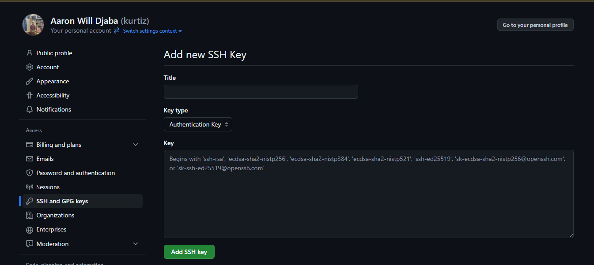

## Setting up SSH Key for Git and GitHub

- First, make sure you have git.
- Make sure you have a GitHub account
- Add your GitHub email and username to your local git
  configuration

 ```bash 
git config --global user.name "username"
git config --global user.email "email"
 ```

replace `"username"` with your GitHub username and replace `"email"` with your GitHub email

- To check if these commands have taken effect, output the
  configuration variables

 ```bash
git config --global --list
 ```

this will output all the config variables that have been set

- Since GitHub no longer supports password authentication
  over git, we will have to set up an SSH key which serves as
  the means of authentication.
- Login into your GitHub account in the browser and navigate
  to the settings page.
- On the settings page, select SSH and GPG keys
- Click on a new SSH key
- GitHub will provide you with a form with three input fields.
  The first one is the
    - **"Title"**: This is pretty much the name or
      tag you would use to identify the machine which will use this
      key. It helps with managing the keys, especially if they're
      many.
    - **"Key Type"**: it is used to determine what the key will be used for.
    - **"Key"**: which is the encrypted key we will be using.



- We will have to generate our key and link it to our GitHub
  account. GitHub recommends the ed25519 encryption but allows
  rsa encryption if you're using a legacy system.
- To create the key, we will use the ssh-keygen command.

 ```bash
ssh-keygen -t ed25519 -C "your_email@example.com"
 ```

:::warning[Note!]

_Please note that the email using are using should be your primary
email on GitHub_

:::

- Upon running this command, the program will request a location
  to save the file. To leave it as default, press enter.
- The request would be for you to enter a password if you would
  like to further secure your SSH key. If you don't want to use a
  password, press "Enter"
- Retype the password again or just press 'Enter' if you did not
  enter a password previously.
- Upon completion, an SSH key will be generated. It actually generates
  two keys. A private key and a public key. the private key is kept
  on your local machine, and the public key is sent to GitHub.
  The two keys are required to decrypt and authenticate your connection
  to GitHub
- Now we will have to register our newly generated key to our ssh
  service. Usually the key generated is saved in a '.ssh' folder in
  your home directory.

- Let's start the SSH agent on our local machine

:::info[Note!]

_Windows users using Git Bash can run the commands under Linux_

:::

### For Windows

open PowerShell in administrator mode
and run the following commands

```powershell
Set-Service ssh-agent -StartupType Manual
Start-Service ssh-agent
ssh-agent -s
```

### For Linux / MacOS

```bash
eval "$(ssh-agent -s)"
 ```

This should return the process ID like this

 ```bash
 Agent pid 286
 ```

- Now we can add our SSH key.

 ```bash
ssh-add ~/.ssh/id_ed25519
 ```

If you used a password when generating the key, you will be
required to enter the password, otherwise it will be added
automatically.
You should get a response stating that the identity has been
added

- Let's copy the content of the file to our
  clipboard.

## Windows users
--------------------------------------

 ```bash
cat ~/.ssh/id_ed25519.pub | clip
 ```

--------------------------------------
## Linux users
--------------------------------------

 ```bash
cat ~/.ssh/id_ed25519.pub
 ```

- this will output the content of the file, select and copy it

---------------------------------------
## MacOS users
---------------------------------------

 ```bash
pbcopy < ~/.ssh/id_ed25519.pub
 ```

---------------------------------------

- With the key copied to our clipboard, we will go back to our GitHub
  settings page > SSH and GPG Keys and paste the content in the
  key field. Enter the Name you would want to use to identify
  your machine on GitHub. Select authentication as the key type
  and click add. <br/>

:::warning[Note!]

_Please make sure there is no whitespace before
or after the key when copying or pasting._

:::

- We’ve successfully added the SSH key to GitHub. Let's test it to see
  if it works.

 ```bash
ssh -T git@github.com
 ```

Since this is our first time using this machine to ssh into GitHub,
we will encounter a warning screen. The warning is to prompt you 
about connecting to an SSH server for the first time. 

Type yes and press "Enter".
A message like this should be returned

 ```bash
 Hi username! You've successfully authenticated, but GitHub 
 does not provide shell access.
 ``` 

Any response apart from this
means there has been an error, either with setting up the key or
internet problem.