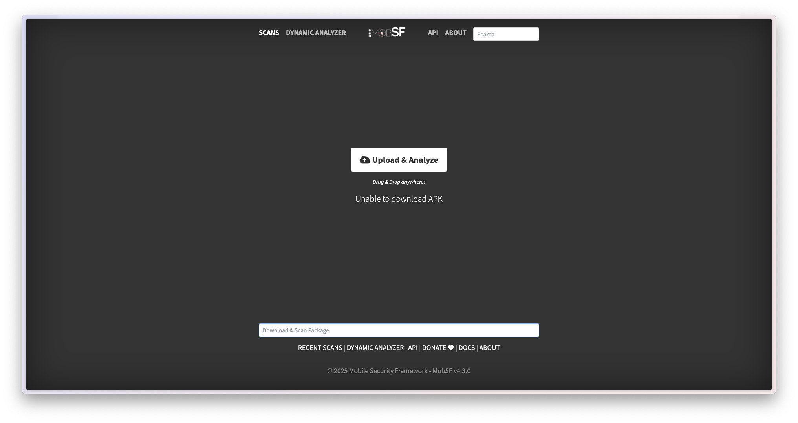
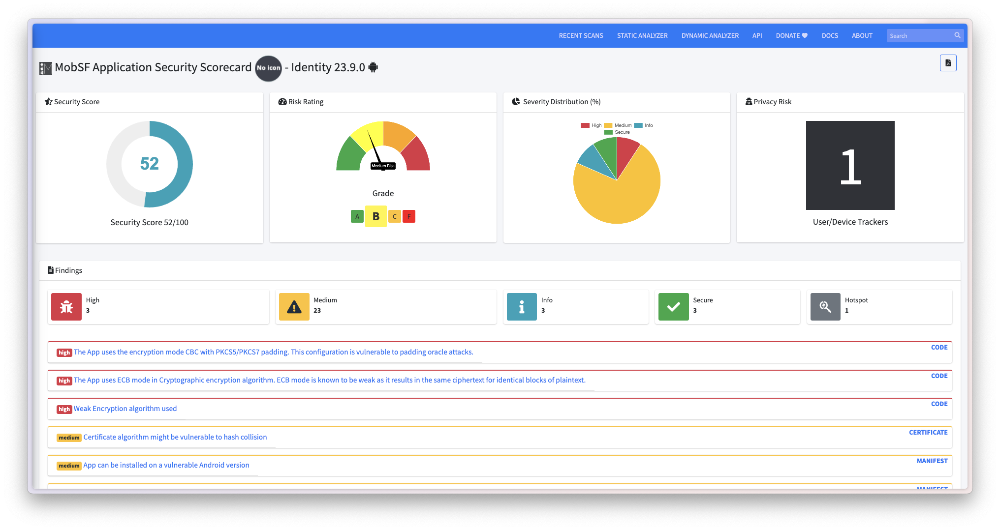
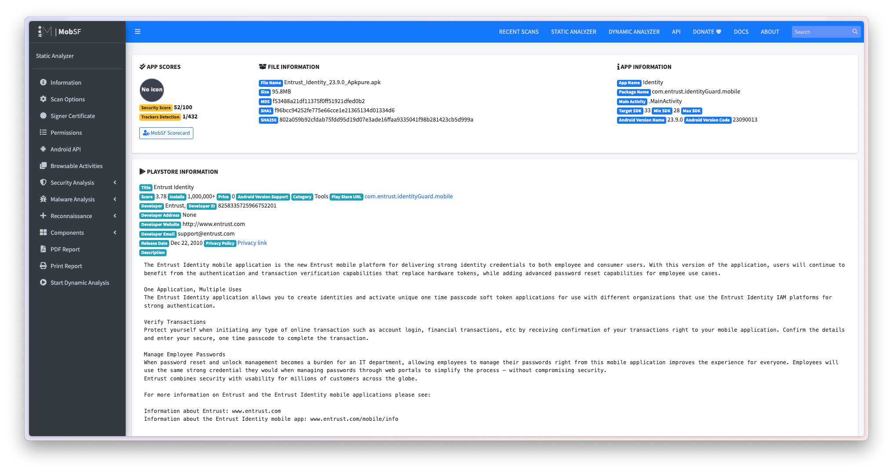
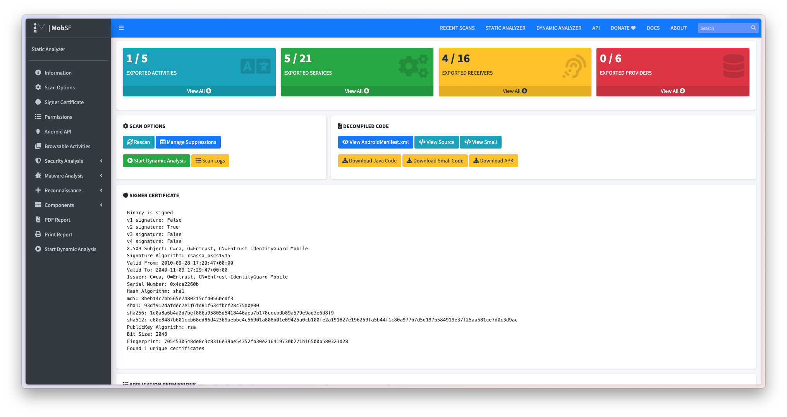
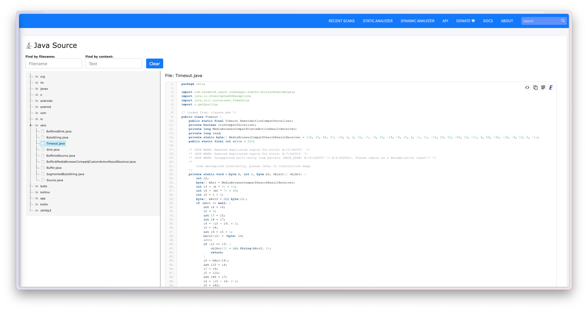

# With MobSF Web

This document provides detailed instructions on how to reverse engineer an Android app
using the MobSF web interface.

---

## Introduction

### What is MobSF?

Mobile Security Framework (MobSF) is a security research platform for mobile applications in 
Android, iOS and Windows Mobile. MobSF can be used for a variety of use cases such as mobile 
application security, penetration testing, malware analysis, and privacy analysis. 

_**Read more about MobSF** [**here**](https://mobsf.live)_

### What is MobSF Web?

The MobSF (Mobile Security Framework) web interface is a tool for reverse engineering and analyzing Android apps.
It provides a user-friendly interface for analyzing Android apps, including the ability to
decompile, deobfuscate, and analyze code.

## How to Use MobSF Web

To use the MobSF web interface, follow these steps:

1. Open the [MobSF web](https://mobsf.live) interface in your web browser.
2. Enter the URL of the app you want to reverse engineer or upload the APK file.
3. Wait for the analysis to complete and the results to be displayed.

The MobSF web interface provides a user-friendly interface for analyzing Android apps,
including the ability to decompile, deobfuscate, and analyze code.

---